# aws-describe-tool

## 概要

AWSのリソースの情報の出力を行う

## 目的

CloudFormationでリソースを作成した際、作成した対象の情報をS3に格納する。
構成管理はAWS Configでも実施可能だが、以下の理由から本ツールを作成する。

- AWS Configで追いきれないリソースがあるため
- スタックごとにグルーピングして確認したいため


## 構成



## フロー

### 開発者がCloudFormationスタックを作成する

開発者はコマンドラインからCloudFormationスタックを作成する。

### CloudFormationがイベントを発行し、EventBridgeが発火する

EventBridgeは以下に該当するイベントを契機に発火する。

```json
{
  "detail-type":"CloudFormation Stack Status Change",
  "source":"aws.cloudformation",
  "detail":{
    "status-details":{
      "status":"(CREATE_COMPLETE|UPDATE_COMPLETE|IMPORT_COMPLETE)",
    },
  }
}
```

参考

- [Stack status event schema](https://docs.aws.amazon.com/AWSCloudFormation/latest/UserGuide/eventbridge-events.html#schema-stack-status-event)  
  スタックの状態が変更された時に発行されるイベントのスキーマ
- [Stack status codes](https://docs.aws.amazon.com/AWSCloudFormation/latest/UserGuide/using-cfn-describing-stacks.html#cli-stack-status-codes)  
  イベントのステータス一覧

### EventBridgeがLambdaを呼び出す

引数：スタック名

### Lambdaがスタックから情報を取得し、S3にデータを格納する

処理：スタックのdescribeの結果をS3に格納する


## セットアップ

### VSCode推奨の拡張機能の追加

`Ctrl` + `Shift` + `X` → @recommended と入力する  
"WORKSPACE RECOMMENDAATIONS" の内容をすべてインストールする

### DevContainerのオープン

`Ctrl` + `Shift` + `P` → "Reopen Folder in DevContainer"

開かれたらpythonとawscliのバージョンを確認

```bash
vscode ➜ /workspace (feature/setup) $ python --version
Python 3.12.0
vscode ➜ /workspace (feature/setup) $ aws --version
aws-cli/2.13.31 Python/3.11.6 Linux/5.10.16.3-microsoft-standard-WSL2 exe/x86_64.debian.11 prompt/off
```

pipのアップグレード

```bash 
pip install --upgrade pip
```

### 各ツールのインストール

#### cfn-lint

```python
pip install cfn-lint

vscode ➜ /workspace (feature/setup) $ cfn-lint --version
cfn-lint 0.83.1
```

#### GitHub Copilot

省略
